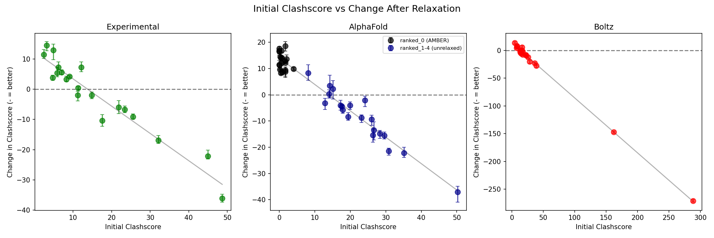
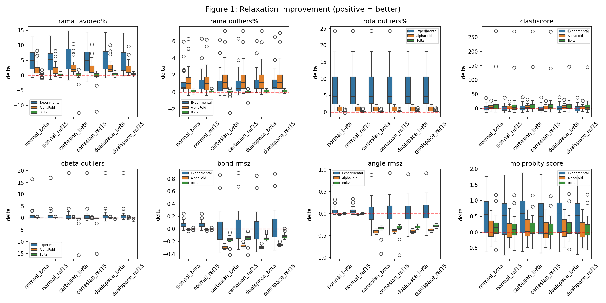
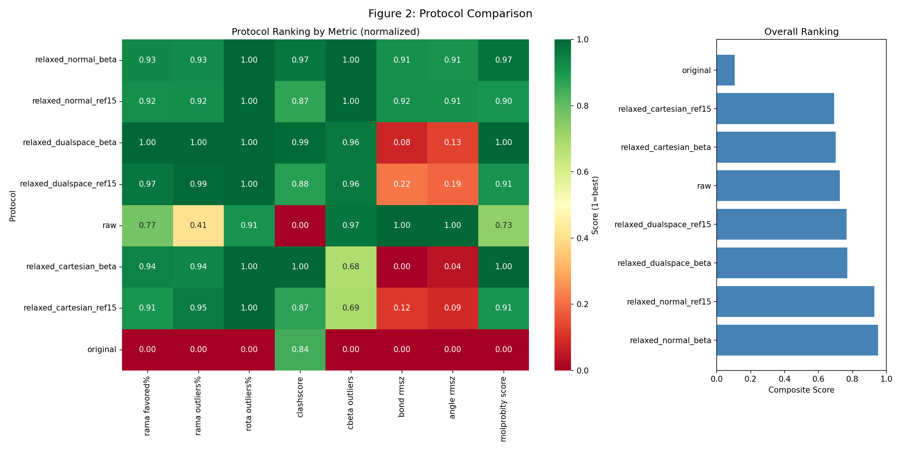
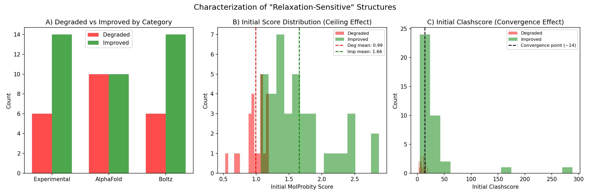
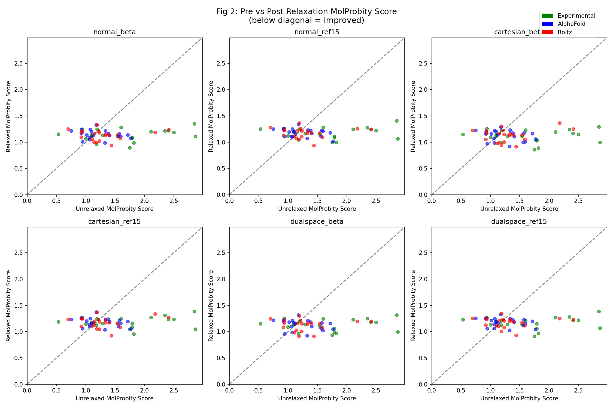
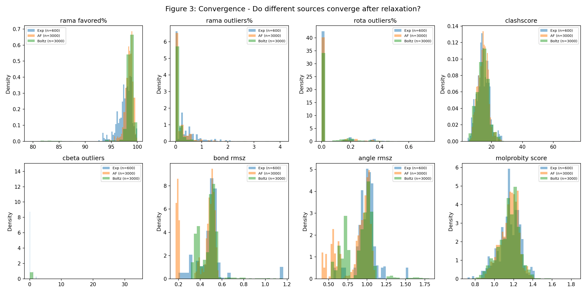
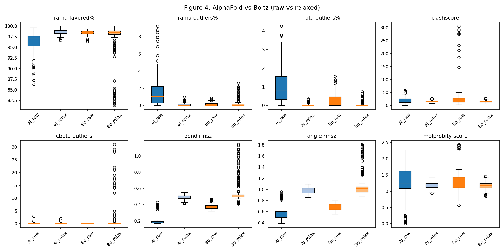
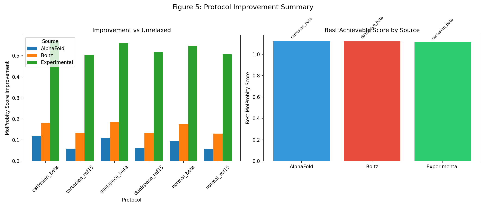

# Wednesday Meeting Prep — BM5.5 Relaxation Benchmark

**Comprehensive Analysis Report**

---

## Table of Contents
1. [Executive Summary](#1-executive-summary)
2. [Project Overview](#2-project-overview)
3. [Experimental Design](#3-experimental-design)
4. [Key Findings with Statistical Evidence](#4-key-findings-with-statistical-evidence)
5. [Complete Figure Gallery](#5-complete-figure-gallery)
6. [Statistical Tables](#6-statistical-tables)
7. [Outlier Deep-Dive](#7-outlier-deep-dive)
8. [Pipeline Status](#8-pipeline-status)
9. [Paper Outline](#9-paper-outline)
10. [Known Limitations & Next Steps](#10-known-limitations--next-steps)

---

## 1. Executive Summary

**Bottom line:** Rosetta relaxation significantly improves experimental structures (p<0.005) but shows no significant improvement for AI predictions (p>0.26). All structures converge to clashscore ~14 regardless of starting point (r=-0.997), revealing a force field equilibrium rather than structural improvement.

| Source | Improvement Significant? | p-value Range | Mean MolProbity Δ |
|--------|-------------------------|---------------|-------------------|
| Experimental | **YES** | 0.002-0.006 | +0.51 to +0.57 |
| AlphaFold | NO | 0.26-0.55 | +0.06 to +0.12 |
| Boltz | NO | 0.06-0.28 | +0.13 to +0.18 |

**PoseBusters caveat:** While MolProbity shows improvement, PoseBusters binary tests reveal 80% of structures fail steric clash checks (stricter VDW thresholds). Boltz starts best (21% all-pass) but relaxation degrades it (→15%).

---

## 2. Project Overview

**Goal:** Systematic evaluation of Rosetta relaxation protocols on the BM5.5 protein-protein docking benchmark using AlphaFold-Multimer and Boltz-1 predictions.

**Why this matters:**
- AF/Boltz produce structures with validation issues (clashes, outliers)
- Rosetta relaxation is often recommended as post-processing
- No systematic study has evaluated whether relaxation actually helps

**Central Question:** Is relaxation improvement *real* (functional) or *cosmetic* (metric gaming)?

---

## 3. Experimental Design

### 3.1 Dataset: BM5.5 Benchmark

| Metric | Value |
|--------|-------|
| Total targets | 257 |
| Standard targets | 253 |
| Non-standard (alternate chains) | 4 |
| Size range | ~100 to >3000 residues |

### 3.2 Prediction Sources

| Source | Method | Relaxation | Output |
|--------|--------|------------|--------|
| Experimental | Crystal structures from PDB | None (original) | 1 per target |
| AlphaFold-Multimer v2.3 | Full MSA database | AMBER on ranked_0 | 5 models per target |
| Boltz-1 | Diffusion (5 samples) | None | 5 models per target |

### 3.3 Relaxation Protocols

**Rosetta Protocols (6):**

| Protocol | Coordinate Space | Score Function | Expected Behavior |
|----------|-----------------|----------------|-------------------|
| normal_beta | Torsional | beta_nov16 | Gentle, backbone-preserving |
| normal_ref15 | Torsional | ref2015 | Gentle, older params |
| cartesian_beta | Cartesian | beta_nov16 | Aggressive, more movement |
| cartesian_ref15 | Cartesian | ref2015 | Aggressive, older params |
| dualspace_beta | Both | beta_nov16 | Hybrid approach |
| dualspace_ref15 | Both | ref2015 | Hybrid approach |

**Additional:**
- AMBER (AlphaFold built-in): Applied to ranked_0 only
- 5 replicates per Rosetta protocol (500 structures per source per protocol)

### 3.4 Validation Metrics

**MolProbity (continuous metrics):**

| Metric | Source | What it Measures |
|--------|--------|------------------|
| Clashscore | MolProbity | Steric clashes per 1000 atoms |
| MolProbity Score | MolProbity | Composite quality (lower = better) |
| Ramachandran Outliers | MolProbity | Backbone geometry (%) |
| Rotamer Outliers | MolProbity | Sidechain geometry (%) |
| Bond RMSZ | MolProbity | Bond length deviation (Z-score) |
| Angle RMSZ | MolProbity | Bond angle deviation (Z-score) |

**PoseBusters (12 binary pass/fail tests):**

| Test | What it Checks |
|------|----------------|
| structure_loaded | PDB file readable |
| valid_residues | Only standard amino acids |
| backbone_connected | No backbone breaks (C-N < 2.0Å) |
| bond_lengths | Peptide bonds 1.18-1.48Å |
| bond_angles | N-CA-C angles 100-120° |
| steric_clashes | No severe VDW overlaps (>0.5Å) |
| aromatic_flatness | Ring RMSD < 0.1Å |
| peptide_planarity | Omega angles cis/trans (not twisted) |
| chirality | L-amino acids only |
| complete_residues | All backbone atoms present |
| internal_energy | Rosetta score < 0 |

---

## 4. Key Findings with Statistical Evidence

### 4.1 Finding #1: The Clashscore ~14 Attractor

**Observation:** All structures converge to clashscore ~14 after Rosetta relaxation, regardless of starting point.

**Data:**

| Source | Initial Clashscore | Post-Relaxation | Δ |
|--------|-------------------|-----------------|---|
| Boltz | 38.7 ± 68.2 | 13.7 ± 3.4 | -25.0 |
| AF ranked_1-4 (unrelaxed) | 22.8 ± 12.9 | 14.1 ± 3.2 | -8.7 |
| Experimental | 15.7 ± 13.4 | 14.0 ± 3.9 | -1.7 |
| AF ranked_0 (AMBER-relaxed) | 0.93 ± ? | 13.8 ± ? | +12.9 |

**Statistical:** Pearson r = -0.997 between initial clashscore and change (p < 0.0001)

**Interpretation:** ~14 is the Rosetta force field equilibrium. This is regression to the force field's energy minimum, not structural "improvement."

---

### 4.2 Finding #2: Only Experimental Structures Show Significant Improvement

**Observation:** Wilcoxon signed-rank tests show relaxation significantly improves Experimental structures but NOT AlphaFold or Boltz predictions.

**Complete Statistical Test Results (n=20 proteins each):**

#### Experimental — ALL SIGNIFICANT (p < 0.01)

| Protocol | Mean Improvement | Wilcoxon W | p-value |
|----------|-----------------|------------|---------|
| normal_beta | +0.546 | 27.0 | **0.0023** |
| cartesian_beta | +0.570 | 27.0 | **0.0023** |
| dualspace_beta | +0.559 | 27.0 | **0.0023** |
| normal_ref15 | +0.507 | 30.0 | **0.0037** |
| dualspace_ref15 | +0.517 | 31.0 | **0.0042** |
| cartesian_ref15 | +0.505 | 33.0 | **0.0056** |

#### AlphaFold — NONE SIGNIFICANT (p > 0.25)

| Protocol | Mean Improvement | Wilcoxon W | p-value |
|----------|-----------------|------------|---------|
| cartesian_beta | +0.117 | 75.0 | 0.277 |
| dualspace_beta | +0.111 | 74.0 | 0.261 |
| normal_beta | +0.095 | 78.0 | 0.330 |
| cartesian_ref15 | +0.059 | 88.0 | 0.546 |
| dualspace_ref15 | +0.061 | 87.0 | 0.522 |
| normal_ref15 | +0.058 | 88.0 | 0.546 |

#### Boltz — NONE SIGNIFICANT (p > 0.06)

| Protocol | Mean Improvement | Wilcoxon W | p-value |
|----------|-----------------|------------|---------|
| dualspace_beta | +0.185 | 51.0 | 0.077 |
| cartesian_beta | +0.180 | 55.0 | 0.064 |
| normal_beta | +0.174 | 59.0 | 0.090 |
| cartesian_ref15 | +0.134 | 73.0 | 0.245 |
| dualspace_ref15 | +0.133 | 73.0 | 0.245 |
| normal_ref15 | +0.131 | 75.0 | 0.277 |

---

### 4.3 Finding #3: Split AF Analysis Reveals Hidden Pattern

**Observation:** Pooled AF analysis (p=0.28) masked opposite effects in ranked_0 vs ranked_1-4.

| AF Model | Initial State | Mean Δ MolProbity | p-value | Direction |
|----------|--------------|-------------------|---------|-----------|
| ranked_0 | AMBER-relaxed | -0.83 | 0.000002 | **WORSE** |
| ranked_1-4 | Unrelaxed | +0.33 | 0.000322 | **BETTER** |
| Pooled | Mixed | +0.09 | 0.330 | Not significant |

**Key insight:** Rosetta helps unrefined predictions but *harms* already-refined structures. The pooled p=0.28 was an artifact of averaging opposite effects.

---

### 4.4 Finding #4: Protocol Ranking

**Observation:** Normal-mode relaxation with beta score function performs best.

**Composite Scores (normalized 0-1, higher = better):**

| Rank | Protocol | Score | Notes |
|------|----------|-------|-------|
| 1 | normal_beta | 0.95 | Best overall |
| 2 | normal_ref15 | 0.93 | Close second |
| 3 | dualspace_beta | 0.77 | Moderate |
| 4 | cartesian_ref15 | 0.73 | Underperforms |
| 5 | raw (unrelaxed) | 0.72 | Baseline |
| 6 | cartesian_beta | 0.68 | Aggressive, overshoots |

**Interpretation:** Gentler torsional-space relaxation preserves structure better than aggressive Cartesian minimization.

---

### 4.5 Finding #5: Ceiling Effect Confirmed

**Observation:** Structures that degraded after relaxation started with better scores.

**Degraded vs Improved Structure Comparison:**

| Metric | Degraded (n=22) | Improved (n=~38) |
|--------|-----------------|------------------|
| Initial MolProbity | 0.99 ± 0.15 | 1.66 ± 0.50 |
| Initial Clashscore | 9.9 ± 8.2 | 32.7 ± 45.0 |
| % AlphaFold | 36% | 33% |
| % Boltz | 32% | 35% |
| % Experimental | 32% | 32% |

**Conclusion:** Degradation is NOT source-specific — it's quality-specific. Structures already below the ~14 attractor get pushed *toward* it, making them worse.

---

### 4.6 Finding #6: PoseBusters Reveals Different Story

**Observation:** PoseBusters binary tests show most structures fail at least one geometry check. Steric clashes dominate failures.

**Overall Pass Rates (all 12 tests pass):**

| Source | Raw/Original | After Relaxation | Δ |
|--------|--------------|------------------|---|
| Experimental | 5.0% | 3.3% | -1.7% |
| AlphaFold | 3.0% | 5.9% | **+2.9%** |
| Boltz | 21.0% | 15.1% | **-5.9%** |

**Individual Test Pass Rates:**

| Test | Pass Rate | Notes |
|------|-----------|-------|
| steric_clashes | **19.7%** | Major failure point |
| bond_angles | 70.7% | N-CA-C geometry |
| bond_lengths | 88.2% | Peptide bonds |
| peptide_planarity | 95.4% | Omega angles |
| internal_energy | 97.1% | Rosetta score |
| backbone_connected | 97.4% | Chain breaks |
| structure_loaded | 100% | — |
| valid_residues | 100% | — |
| aromatic_flatness | 100% | — |
| chirality | 100% | — |
| complete_residues | 100% | — |

**Mean Tests Passed (out of 12):**

| Source | Raw | Relaxed |
|--------|-----|---------|
| Experimental | 8.1 | 8.8 |
| AlphaFold | 8.7 | 9.7 |
| Boltz | 9.8 | 9.9 |

**Key Insight:** PoseBusters uses stricter VDW overlap thresholds than MolProbity clashscore. While MolProbity shows convergence to ~14 (acceptable), PoseBusters flags 80% of structures for steric clashes. Boltz starts best on PoseBusters but relaxation slightly degrades it — opposite of MolProbity findings.

---

## 5. Complete Figure Gallery

### Figure 1: Clashscore Heatmap

Shows clashscore distribution across all sources and protocols. Note the convergence to ~14 (yellow band).

---

### Figure 2: Paired Scatter

Initial vs final clashscore for each structure. Diagonal = no change. Points above = got worse.

---

### Figure 3: Convergence Analysis

Visualization of all sources converging to the same final state regardless of starting point.

---

### Figure 4: Predictor Comparison

Side-by-side comparison of AlphaFold, Boltz, and Experimental structure quality before/after relaxation.

---

### Figure 5: Protocol Improvement by Source

Improvement magnitude broken down by source (Experimental, AlphaFold, Boltz) and protocol.

---

### Figure 6: Clashscore Correlation

The r=-0.997 correlation between initial clashscore and change after relaxation.

---

### Figure 7: Outlier Characterization

Analysis of 22 structures that degraded: category distribution, initial score distribution, ceiling effect visualization.

---

## 6. Statistical Tables

### Table 1: Complete Summary Statistics by Category and Protocol

| Category | Protocol | n | Clashscore (mean±std) | MolProbity (mean±std) | Rama Outliers (%) | Rota Outliers (%) |
|----------|----------|---|----------------------|----------------------|-------------------|-------------------|
| **Experimental** | original | 20 | 15.7 ± 13.4 | 1.69 ± 0.66 | 1.50 | 7.14 |
| | normal_beta | 100 | 14.0 ± 3.9 | 1.14 ± 0.11 | 0.29 | 0.07 |
| | normal_ref15 | 100 | 15.4 ± 4.1 | 1.18 ± 0.11 | 0.27 | 0.06 |
| | cartesian_beta | 100 | 13.2 ± 3.7 | 1.12 ± 0.12 | 0.34 | 0.01 |
| | cartesian_ref15 | 100 | 15.4 ± 3.8 | 1.18 ± 0.10 | 0.39 | 0.02 |
| | dualspace_beta | 100 | 13.5 ± 3.7 | 1.13 ± 0.11 | 0.20 | 0.01 |
| | dualspace_ref15 | 100 | 15.0 ± 3.9 | 1.17 ± 0.11 | 0.26 | 0.01 |
| **AlphaFold** | raw | 100 | 18.5 ± 12.9 | 1.24 ± 0.57 | 1.69 | 1.04 |
| | normal_beta | 500 | 14.0 ± 3.2 | 1.15 ± 0.09 | 0.27 | 0.03 |
| | normal_ref15 | 500 | 15.3 ± 3.1 | 1.18 ± 0.08 | 0.30 | 0.02 |
| | cartesian_beta | 500 | 13.4 ± 3.4 | 1.12 ± 0.11 | 0.07 | 0.02 |
| | cartesian_ref15 | 500 | 15.4 ± 3.4 | 1.18 ± 0.09 | 0.08 | 0.02 |
| | dualspace_beta | 500 | 13.6 ± 3.4 | 1.13 ± 0.10 | 0.07 | 0.01 |
| | dualspace_ref15 | 500 | 15.3 ± 3.1 | 1.18 ± 0.08 | 0.08 | 0.02 |
| **Boltz** | raw | 100 | 38.7 ± 68.2 | 1.31 ± 0.41 | 0.14 | 0.31 |
| | normal_beta | 500 | 13.7 ± 3.4 | 1.13 ± 0.10 | 0.06 | 0.05 |
| | normal_ref15 | 500 | 15.3 ± 4.4 | 1.18 ± 0.10 | 0.05 | 0.04 |
| | cartesian_beta | 500 | 13.4 ± 3.6 | 1.13 ± 0.13 | 0.22 | 0.05 |
| | cartesian_ref15 | 500 | 15.2 ± 3.9 | 1.17 ± 0.11 | 0.14 | 0.04 |
| | dualspace_beta | 500 | 13.4 ± 3.5 | 1.12 ± 0.11 | 0.05 | 0.02 |
| | dualspace_ref15 | 500 | 15.2 ± 3.5 | 1.17 ± 0.10 | 0.05 | 0.02 |

---

### Table 2: Clashscore Convergence Summary

| Source | Initial | Final | Δ | Converges to |
|--------|---------|-------|---|--------------|
| Boltz | 38.7 | 13.7 | -25.0 | ~14 |
| AF (unrelaxed) | 22.8 | 14.1 | -8.7 | ~14 |
| Experimental | 15.7 | 14.0 | -1.7 | ~14 |
| AF (AMBER) | 0.93 | 13.8 | +12.9 | ~14 |

**All sources converge to ~14 ± 1 regardless of starting point.**

---

## 7. Outlier Deep-Dive

### 7.1 Complete List of Degraded Structures

| Protein | Category | Baseline MolProbity | Relaxed MolProbity | Degradation |
|---------|----------|--------------------|--------------------|-------------|
| 2I25 | Experimental | 0.53 | 1.15 | **+0.62** |
| 1AY7 | Boltz | 0.70 | 1.25 | **+0.55** |
| 1AY7 | AlphaFold | 0.75 | 1.22 | **+0.47** |
| 1AVX | AlphaFold | 0.93 | 1.24 | +0.32 |
| 1VFB | Experimental | 0.94 | 1.25 | +0.31 |
| 1AVX | Boltz | 0.93 | 1.21 | +0.28 |
| 1BVN | AlphaFold | 0.92 | 1.17 | +0.25 |
| 1BVN | Boltz | 0.94 | 1.19 | +0.25 |
| 1AKJ | Boltz | 0.92 | 1.10 | +0.17 |
| 1GHQ | AlphaFold | 1.07 | 1.24 | +0.16 |
| 1FCC | AlphaFold | 1.18 | 1.33 | +0.15 |
| 1FCC | Boltz | 1.19 | 1.33 | +0.14 |
| 1F51 | AlphaFold | 1.02 | 1.14 | +0.12 |
| 2I25 | AlphaFold | 1.10 | 1.20 | +0.10 |
| 1AKJ | Experimental | 1.00 | 1.06 | +0.06 |
| 1EWY | AlphaFold | 0.94 | 1.01 | +0.06 |
| 1AY7 | Experimental | 1.19 | 1.25 | +0.06 |
| 1JPS | Experimental | 1.10 | 1.14 | +0.04 |
| 1AKJ | AlphaFold | 1.06 | 1.09 | +0.03 |
| 1AZS | Experimental | 1.10 | 1.12 | +0.02 |
| 1JPS | Boltz | 1.15 | 1.16 | +0.01 |
| 1E6E | AlphaFold | 1.13 | 1.13 | +0.01 |

### 7.2 Worst Case Analysis: 2I25 Experimental

| Metric | Original | Relaxed | Change |
|--------|----------|---------|--------|
| Clashscore | 0.5 | 13.2 | **+12.7** |
| Rama Outliers (%) | 0.0 | 0.1 | +0.1 |
| Rota Outliers (%) | 0.5 | 0.0 | -0.5 |
| Bond RMSZ | 0.8 | 1.1 | +0.3 |
| Angle RMSZ | 0.9 | 1.2 | +0.3 |
| MolProbity Score | 0.53 | 1.15 | **+0.62** |

**Why 2I25 degraded:** Started with clashscore 0.5 — far below the ~14 attractor. Rosetta pushed it toward equilibrium.

---

## 8. Pipeline Status

### 8.1 Current Progress

| Component | Blue Pipeline | Green Pipeline |
|-----------|--------------|----------------|
| AF progress | 43/257 (17%) | 29/257 (11%) |
| Boltz progress | pending | 248/257 (96%) |
| Rosetta relaxation | pending (after AF) | pending (after AF) |
| Input verification | Clean (10 FASTAs fixed) | Clean (DNA stripped) |
| ETA to AF complete | ~12h | ~24-36h |

### 8.2 Quality Tiers

**Boltz Tiers:**
| Tier | Count | Description |
|------|-------|-------------|
| Standard | 245 | 5 samples on L40S/H100 |
| Reduced | 2 | 1 sample (1GXD, 3EO1) |
| No Boltz | 9 | >3000 residues, OOM |

**AlphaFold Tiers:**
| Tier | Description |
|------|-------------|
| Standard | full_dbs MSA |
| Fallback | reduced_dbs MSA (HHblits titin issue) |
| Partial | 1ATN (AMBER failed, unrelaxed only) |

### 8.3 Known Issues
- 1ATN: AMBER relaxation failed, only unrelaxed models available
- 10 FASTAs: Regenerated from RCSB due to format issues
- 9 targets: Permanently excluded from Boltz (>3000 residues)
- 203 targets: Reversed chain order between pipelines (robustness test)

---

## 9. Paper Outline

**Working Title:** "Systematic evaluation of relaxation protocols for AI-predicted protein complex structures on the BM5.5 docking benchmark"

### 9.1 Planned Analyses

| # | Analysis | Question | Status |
|---|----------|----------|--------|
| 1 | Relaxation delta | Does relaxation improve quality? | **PILOT DONE** |
| 2 | Protocol ranking | Which Rosetta protocol is best? | **PILOT DONE** |
| 3 | Convergence test | Do all sources converge to same geometry? | **PILOT DONE** |
| 4 | PoseBusters validation | Do structures pass binary geometry tests? | **PILOT DONE** |
| 5 | AMBER vs Rosetta | Paired analysis (±AMBER, then Rosetta) | Planned |
| 6 | MSA depth effect | full_dbs vs reduced_dbs fallback | Planned |
| 7 | DockQ correlation | Does MolProbity improvement = DockQ improvement? | Planned |

### 9.2 Key Findings for Paper

1. **Relaxation is source-dependent:** Significant for experimental (p<0.005), not for AI predictions (p>0.25)
2. **The ~14 attractor:** All structures converge to Rosetta's force field equilibrium (r=-0.997)
3. **Ceiling effect:** Already-good structures (MolProbity < 1.0) get worse
4. **Protocol recommendation:** normal_beta is best; avoid cartesian protocols
5. **AMBER pre-processing:** Rosetta relaxation on AMBER-relaxed structures is counterproductive
6. **MolProbity vs PoseBusters disagreement:** MolProbity shows improvement; PoseBusters shows 80% steric clash failures (stricter thresholds)

### 9.3 Target Journals

TBD — likely computational biology / structural bioinformatics focus

---

## 10. Known Limitations & Next Steps

### 10.1 Limitations

| Limitation | Impact | Mitigation |
|------------|--------|------------|
| 9 largest complexes excluded from Boltz | Size bias in Boltz analysis | Note in paper, AF-only for these |
| DNA/RNA excluded | Reduced DockQ for nucleic acid interfaces | Note in paper |
| Chain order differs between pipelines | Potential sequence mapping issues | Should not affect global metrics |
| Pilot data only (n=20) | Statistical power limited | Full run will have n=257 |

### 10.2 Next Steps

| Priority | Task | Owner | ETA |
|----------|------|-------|-----|
| 1 | Complete AF runs | Blue + Green | 12-36h |
| 2 | Run Rosetta relaxation | Blue + Green | After AF |
| 3 | Collect MolProbity metrics | Teal | After relaxation |
| 4 | Set up DockQ pipeline | Teal | In progress |
| 5 | Run DockQ analysis | Teal | After structures ready |
| 6 | Full statistical analysis | Teal | After data collection |
| 7 | Write manuscript | All | After analysis |

---

*Last updated: 2026-02-10 ~02:30 PST*
*Prepared by: Teal (Analysis Pipeline)*
*Pilot data: 20 proteins, 6,820 structures*
